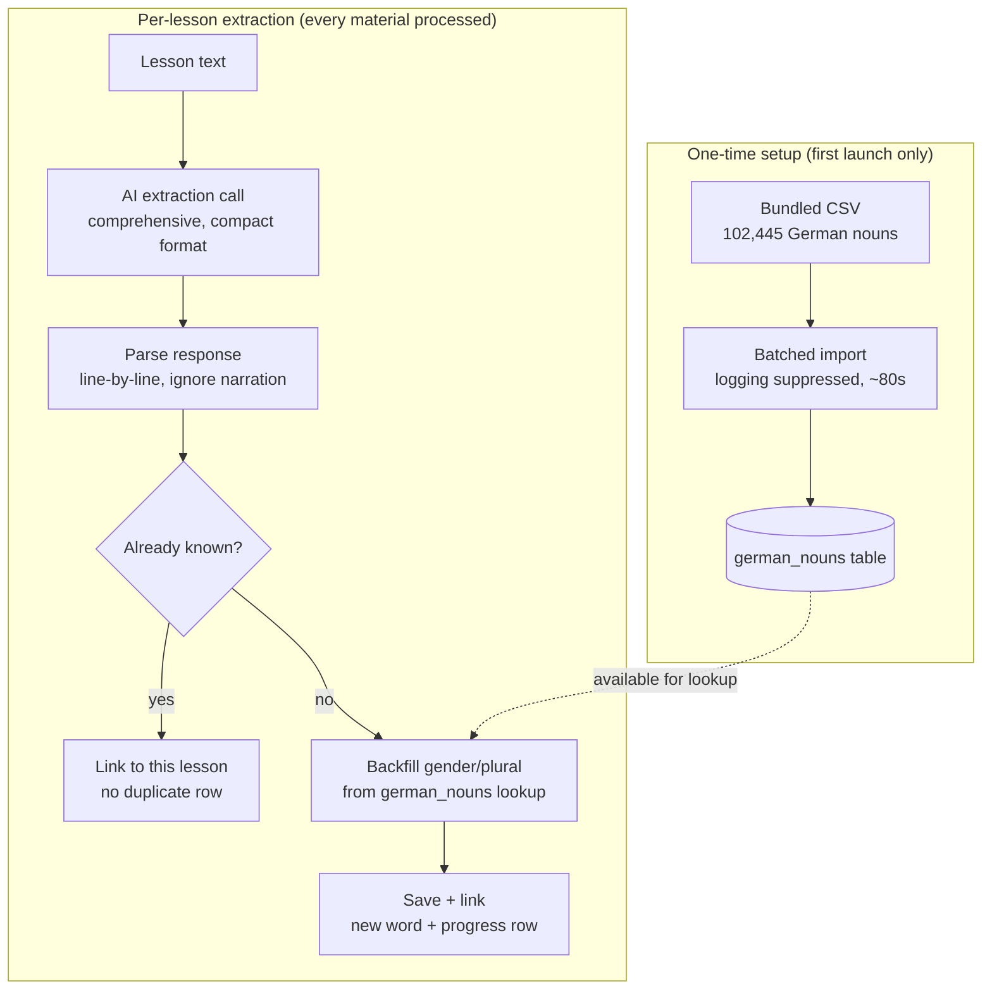

# Vocabulary Extraction Pipeline — Overview

What this covers: the AI-token-reduction and reliability work done on Evola's vocabulary
extraction pipeline. For the full decision-by-decision history (including options considered and
rejected), see [AI_TOKEN_REDUCTION_PLAN.md](AI_TOKEN_REDUCTION_PLAN.md). This file is the
condensed "what problem, what solution, what's the current state" summary.

## The problem

Vocabulary extraction (`VocabularyExtractor` → AI call → parse → write to DB) had four separate
inefficiencies:

1. **JSON output repeats all 14 field names for every word.** Up to ~250-300 uncacheable output
   characters of pure structure per item, on every single lesson.
2. **Duplicate words were fully re-enriched, then discarded.** Dedup against already-known
   vocabulary happened *after* the AI fully translated/explained a word — wasting the exact output
   tokens the dedup step was about to throw away.
3. **The prompt hardcoded German-specific assumptions** even though the surrounding app is
   already language-parametrized (native language, goal).
4. **Extraction was capped/selective** (15-40 items, judgment call on what's "worth" extracting),
   not comprehensive — a design mismatch with wanting reliable, complete coverage per lesson.

## The solution

### 1. Compact wire format instead of JSON
`VocabularyExtractor` now asks the model for one item per line, 14 values joined by `|`
(`term|meaning|gender|...`), instead of a JSON array of objects. No repeated field names. A
`related_words` list is packed into its own field slot joined by `;`. Considered and rejected:
adopting the TOON format via a library — `JosephSanjaya/ktoon` isn't published to Maven Central;
`lukelast/ktoon` *is* published but is compiled with a newer Kotlin than this project pins,
confirmed by an actual failed compile attempt, not just reading version numbers. Hand-rolling the
format avoided both problems.

### 2. Comprehensive extraction, not capped
The prompt no longer targets a fixed count (previously 15-40). It now asks for every genuine
vocabulary word/phrase in the lesson, while still excluding bare function words unless the lesson
explicitly teaches them.

### 3. Dedup moved earlier, with link-not-duplicate storage
`LocalMaterialsRepository.extractVocabulary` already tracked known terms in memory; it now maps
term → existing item id instead of just a duplicate-check set. When an item comes back as a known
duplicate, the app calls `linkItemToLesson` instead of inserting a new row — the same word can now
belong to multiple lessons without being stored twice. This required a schema change: a new
`lesson_vocabulary_items` join table plus a `lesson_vocabulary` SQL view that every lesson-scoped
query (8 of them) joins through instead of filtering `vocabulary_items.lesson_id` directly.
`vocabulary_items.lesson_id` remains the *origin* lesson (its deletion still cascades the word and
all its links — accepted as simple v1 behavior, not reference-counted cleanup).

### 4. A local German noun dataset for gender/plural correction
`gambolputty/german-nouns` (CC-BY-SA-4.0, ~100k nouns with grammatical gender + full case/number
flexion) is bundled as a resource and imported once into a local `german_nouns` SQLite table
(`GermanNounImporter`) — not re-parsed from the 20MB CSV on every launch. `GermanNounLexicon`
queries that table to backfill `gender`/`plural` when the model leaves them null and the term
matches a known lemma exactly. This is a correction/completion pass on the AI's own output, not a
pre-filter — the dataset has no translations, examples, or mnemonics, so full AI enrichment still
runs for every word regardless.

Two real bugs were found and fixed via actual on-device testing during this build, not caught by
compiling alone:

- **Import took ~5 minutes**, not the intended few-seconds one-time setup — traced to the
  project's `LogSqliteDriver` logging every one of the ~100k individual `INSERT` statements to
  file. Fixed with a `SqlLoggingGate` the importer flips off around its bulk-insert loop only
  (`finally`-protected), leaving normal per-query debug logging untouched everywhere else. Brought
  the import down to ~80 seconds.
- **The model didn't reliably follow the exact wire format.** First failure mode: it wrote a
  numbered list with items split across multiple lines. Fixed with a few-shot example plus
  explicit negative instructions in the prompt. Second (subtler) failure mode, found on retest: the
  model then produced well-formed single-line data almost perfectly, but wrapped it in narration
  ("Let me extract the vocabulary...", a bullet-point preview, "Let me continue with the remaining
  words:") and sometimes repeated the list — which broke the parser's assumption that line 1 is a
  declared item count. Fixed by removing that assumption: the parser now scans every line
  independently and keeps only lines that split into exactly 14 valid pipe-delimited fields,
  silently ignoring anything else (prose, headers, a stray number, blank lines). A duplicate term
  from the model re-listing is caught by the existing dedup step downstream, the same as a
  duplicate arriving from a different lesson.

A one-time, user-visible first-run screen (`VocabDataImportScreen`) shows the noun-dataset import
progress with a real percentage, wired into `App.kt`'s launch flow — every app launch after the
first skips straight past it (a near-instant row-count check).

## Process diagram

## Current status (not yet fully closed out)

- All of the above compiles clean on both platforms and is installed on both test devices.
- The format-robustness fix (independent line scanning) has **not yet been re-verified against a
  fresh real AI response** — it was designed directly from a real captured failure, but needs one
  more on-device test to confirm.
- Known residual limitation, not yet fixed: some model responses collapse multiple consecutive
  empty fields (e.g. gender + plural + translation + IPA all empty in a row) into fewer pipe
  characters than expected, undercounting that line's field count by one or more. The parser
  correctly rejects those lines rather than risk misaligning data into the wrong fields, but that
  means a subset of otherwise-valid items can still be silently dropped. Not addressed yet -
  likely needs either a smarter reconstruction (risky - wrong-field data is worse than dropped
  data) or accepting it as an inherent format-choice cost.
- The `GermanNounLexicon` full local tokenizer/resolver idea (turning it into a genuine token-cost
  reducer for the *candidate identification* step, not just a correction pass) remains descoped -
  real performance risk identified (potentially millions of index entries from the dataset's ~75
  flexion columns) that hasn't been profiled on-device.
